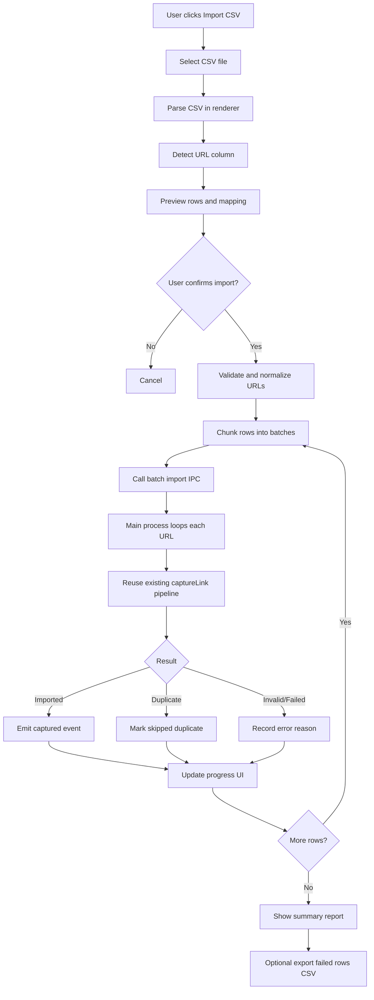

# Bulk CSV Link Import Plan

## Goal
Enable users to import many links (including YouTube links) from a CSV file into Inbox in one workflow, while reusing existing link capture behavior for metadata extraction, duplicate detection, and event updates.

## Scope
- MVP: URL-focused CSV import.
- Optional columns: title, tags, notes, createdAt.
- Keep current single-link capture behavior unchanged.
- Add a dedicated import flow, not a replacement for existing bulk actions.
- Use an Import Queue as the default review surface so new imports do not immediately flood Inbox.

## Task Checklist (Status)

### A) Planning and Product Direction
- [x] Write implementation plan doc for bulk CSV link import.
- [x] Add Mermaid architecture flow.
- [x] Define Import Queue strategy to avoid Inbox clutter.
- [x] Add criteria for promoting Import Queue to a dedicated Imports tab.

### B) Implemented Backend Behavior (Delivered)
- [x] Implement YouTube Hub generation/update utility for YouTube links.
- [x] Append only new YouTube links to existing YouTube Hub note.
- [x] Keep non-YouTube links out of YouTube Hub.
- [x] Gate YouTube Hub behavior behind explicit import option (not enabled for normal bulk filing).
- [x] Add main-process tests for gated YouTube Hub behavior.

### C) Renderer Workflow for CSV Import (Delivered)
- [x] Add Import CSV entry point in Inbox UI.
- [x] Add CSV import modal with file picker.
- [x] Add URL column detection and manual override UI.
- [x] Add preview table with per-row validation status.
- [x] Add confirm import action with progress state.
- [x] Add Import Queue UI actions: Accept selected, Accept all, Discard selected, Retry failed.

### D) CSV Parsing and Validation (Pending)
- [x] Accept UTF-8 CSV with and without headers.
- [x] Support URL header aliases: url, link, source, website.
- [x] Normalize URLs by prepending https when missing.
- [x] Validate URL format before enqueueing import.
- [x] Mark invalid rows early and exclude from import batch.

### E) Contracts and IPC for Bulk URL Import (Pending)
- [x] Add new IPC invoke channel for bulk URL import.
- [x] Add request schema for rows and import options.
- [x] Add response schema for per-row result and totals.
- [x] Expose typed API through preload and renderer service layer.

### F) Main Process CSV Import Handler (Delivered — MVP)
- [x] Reuse existing link capture path per row.
- [x] Preserve duplicate detection and metadata extraction behavior.
- [x] Report per-row status and totals.
- [ ] *(Optional)* Process import rows in chunks with bounded concurrency workers (deferred post-MVP).
- [ ] *(Optional)* Emit progress updates after each chunk (deferred post-MVP).
- [ ] *(Optional)* Call bulk filing with import option that enables YouTube Hub generation for import runs (deferred post-MVP).

### G) Reporting and Recovery (Delivered)
- [x] Show live import counters: processed, imported, duplicate, invalid, failed.
- [x] Show final summary report after import completion.
- [x] Add failed-row CSV export for retry.
- [x] Keep row index and original input for traceability (preserved in per-row response metadata).
- [x] Track Import Queue counts separately from Inbox counts (run-scoped queue in dialog).

### H) Testing for CSV Import (Delivered — Component Level)
- [x] Unit tests for CSV parser (12 tests covering parsing, normalization, URL detection).
- [x] Unit tests for URL normalization and URL-column detection.
- [x] IPC tests for happy path, duplicates, invalid rows, and partial failures (2 integration tests).
- [x] Component tests for Import Queue panel (selection, accept, discard actions).
- [ ] *(Deferred)* E2E UI tests for file picker, preview, override, progress in dialog (jsdom file input limitation).

### I) Safety and Rollout (Post-MVP)
- [ ] Add feature flag for CSV import UI.
- [ ] Set conservative defaults for batch size and concurrency.
- [ ] Add structured logs and diagnostics for import runs.

## User Experience
1. User clicks Import CSV from Inbox.
2. User selects a CSV file.
3. App parses CSV and auto-detects URL column.
4. User sees preview with per-row validation and can override URL column.
5. User confirms import.
6. App navigates to an Import Progress view (or Inbox-embedded import panel) and shows live counters.
7. Imported items land in Import Queue by default (not directly in Inbox).
8. User can open an optional Hub view for that import to browse collected links.
9. From Hub/Queue, user chooses how to organize items out of Inbox (for example file into a collection folder with the hub note).
10. User can Accept all, Accept selected, Discard selected, and Retry failed.
11. App displays summary with imported, duplicate, invalid, and failed counts.
12. Optional: export failed rows as CSV for retry.

## Import Queue Strategy (Recommended)
- Do not create a permanent Imports tab in MVP.
- Add a lightweight Import Queue panel/drawer tied to active or recent import runs.
- Keep Inbox as a curated attention list; only accepted items move into Inbox.
- Add an optional Hub view per import run that lists captured links and supports organization actions.
- Add import options:
  - Send directly to Inbox (toggle, off by default)
  - Auto-file accepted items to folder/tags

## Optional Hub View (Import-Scoped)
- Hub creation should apply to bulk import runs only, not generic bulk filing.
- Hub can be attached to a chosen collection/folder when user finalizes organization.
- Future enhancement: AI grouping of imported links into themes or clusters.

### Promotion Criteria for Dedicated Imports Tab
- Promote to a full Imports tab only if usage indicates sustained demand, for example:
  - frequent large import runs
  - repeated need to revisit historical import batches
  - user feedback that queue discoverability is insufficient

## Architecture Approach
- Parse and validate CSV in renderer for fast feedback.
- Send normalized valid rows to main process via new IPC handler.
- Main process imports rows by reusing existing link capture pipeline.
- Return per-row import results to renderer for live progress and final report.

## Implementation Plan

## Mermaid Diagram

## Notes
- Current bulk actions file existing items (archive, snooze, file, tag) and do not create new Inbox items.
- This feature adds a new import path focused on creating Inbox link items from CSV input.
